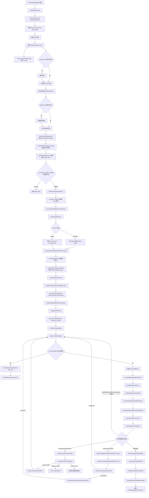
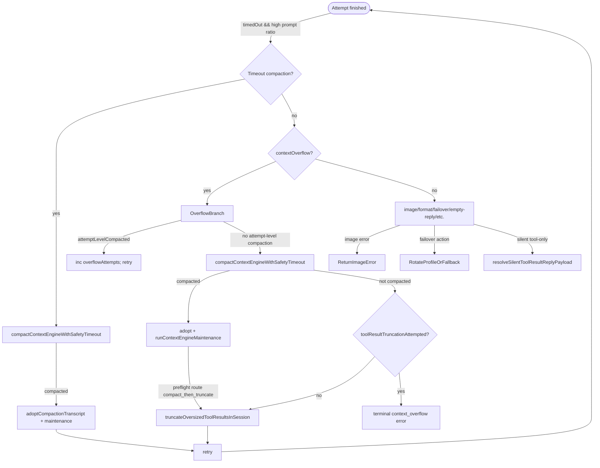
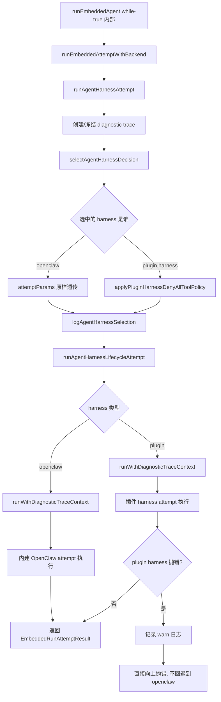
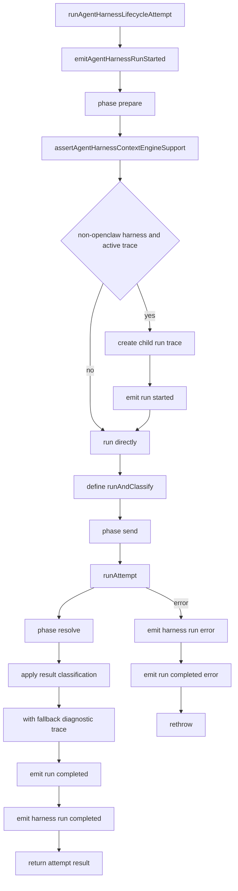
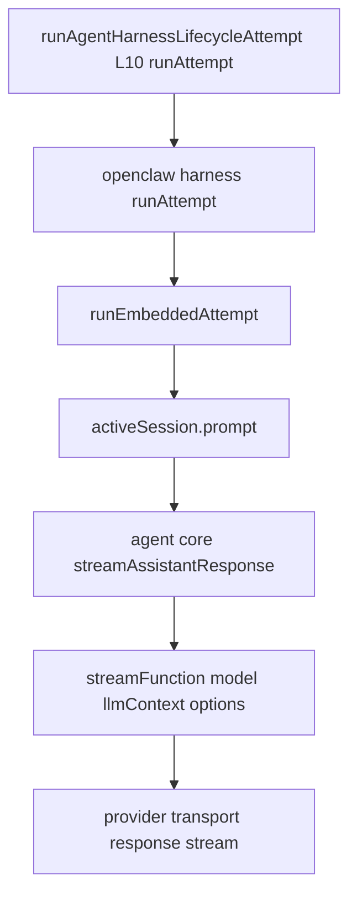

# runEmbeddedAgent 流程图

## 统一流程图



## 后处理流程（Post-processing & Recovery）

以下为 `runEmbeddedAgent` 主循环中与“后处理”相关的主要分支与关键实现位置，便于在同一图谱中查阅：



关键实现文件与函数（快速索引）：

- `src/agents/embedded-agent-runner/run.ts` — 主循环及 compaction / overflow / payload 组装分支。
- `src/agents/embedded-agent-runner/tool-result-truncation.ts` — `truncateOversizedToolResultsInSession()`、`truncateToolResultMessage()`、`estimateToolResultReductionPotential()` 等。
- `src/agents/embedded-agent-runner/run/retry-limit.ts` — `handleRetryLimitExhaustion()`。

如需，我可以把这些节点在当前 visual-map 中标注具体行号或插入链接，或者把文档中的 Mermaid 图复制到 `docs/` 中以便渲染。是否要我把行号直接注入到这份笔记？


### 1.1 这张图的关键边界

先澄清边界：enqueueSession 负责会话队列调度与互斥，不直接承载可恢复执行循环；可恢复执行在其入队的 task 闭包内部。

1. 防同会话并发推进
同一个 session 同时跑两个请求时，工具结果、重试状态、会话文件游标会互相覆盖，最终表现为记忆错乱。

2. 防恢复路径串线
上下文溢出、超时压缩、重试续跑都依赖当前会话状态。若并发进入，会让恢复逻辑基于过期状态继续运行。

3. 防调度饥饿影响前台交互
sessionQueuePriority 将用户触发请求提升优先级，避免后台触发（如 cron、heartbeat）长期压住前台对话。

### 1.2 函数调用说明：调度与入口阶段

| 函数 | 在流程里解决什么 | 关键输入 | 后续影响 |
|---|---|---|---|
| backfillSessionKey | 尽早补齐 sessionKey，避免 hooks、LCM、compaction 使用不同会话键 | sessionId、sessionKey、agentId、config | 后续 params.sessionKey 被 hookCtx、session lane、compaction、attempt 共享 |
| resolveSessionLane | 把 sessionKey/sessionId 映射成会话 lane | params.sessionKey 或 params.sessionId | enqueueSession 使用，保证同会话串行 |
| resolveGlobalLane | 解析全局 lane，包含 cron 嵌套保护 | params.lane | enqueueGlobal 使用，避免全局调度死锁 |
| resolveEmbeddedRunSessionQueuePriority | 根据 trigger 决定前台/后台优先级 | trigger=user/manual/cron/heartbeat/memory/overflow | enqueueSession、enqueueGlobal 都用这个 priority |
| resolveEmbeddedRunLaneTimeoutMs / withEmbeddedRunLaneTimeout | 给排队任务加超时与进度心跳 | timeoutMs、laneTaskProgressAtMs | 防止 lane 被卡死任务永久占用 |
| enqueueSession | 把 task 放进 session lane，并返回 Promise | sessionLane、sessionQueuePriority | 控制同会话互斥；真正执行逻辑在 task 闭包里 |
| enqueueGlobal | 在 session task 内再进入 global lane | globalLane、priority、taskTimeoutMs | 控制全局资源并发和 cron 嵌套 |

### 1.3 函数调用说明：配置、插件、模型、harness 阶段

| 函数 | 功能 | 关键输入 | 后续影响 |
|---|---|---|---|
| resolveRunWorkspaceDir | 决定本次 run 使用哪个 workspaceDir，并顺带确定 agentId 来源 | params.workspaceDir、params.sessionKey、params.agentId、params.config | resolvedWorkspace 传给插件加载、模型解析、auth、contextEngine、attempt；workspaceResolution.agentId 进入 hookCtx、agentDir、harness/model/auth 选择 |
| ensureRuntimePluginsLoaded | 确保运行时插件 registry 已加载；优先复用 gateway 启动阶段写入的 current plugin metadata snapshot | config、workspaceDir、allowGatewaySubagentBinding | 后续 hook runner、provider runtime、agent harness 才可能存在；若 snapshot 带 startup.pluginIds，会把加载范围收窄到这些插件 |
| getGlobalHookRunner | 取得全局插件 hook 执行器，不是队列调度器 | 插件系统初始化后的 registry | cron before_agent_reply、resolveHookModelSelection、compaction hooks 等阶段调用 |
| resolveHookModelSelection | 在真正 resolveModelAsync 前，让插件有机会改 provider/modelId | prompt、images attachments、hookRunner、hookCtx | provider/modelId 被覆写后影响 harness 选择、模型解析、auth profile、runtimePlan |
| ensureSelectedAgentHarnessPlugin | 确认选中的 harness 插件存在或可加载 | provider、modelId、config、agentHarnessRuntimeOverride、workspaceDir | selectAgentHarness 不会选到未准备好的插件 harness |
| selectAgentHarness | 决定 attempt 由 OpenClaw 内建 harness 还是插件 harness 执行 | provider、modelId、config、agentId、sessionKey、agentHarnessId、agentHarnessRuntimeOverride | agentHarness.id 决定 pluginHarnessOwnsTransport、auth bootstrap、runtime provider、runEmbeddedAttemptWithBackend 的 agentHarnessId |
| resolveSelectedOpenAIRuntimeProvider | 把 OpenAI 相关 provider 规范化为 openai runtime provider | provider、harnessRuntime、authProfileId、config | modelResolutionProviders 可能从 runtime provider 再回退到原 provider |
| resolveModelAsync | 从模型目录/插件/catalog 中解析模型定义；最多会被两轮调用 | provider/modelId、agentDir、config、workspaceDir、authProfileId | 产出 model、authStorage、modelRegistry；两轮都找不到 model 时会抛 model_not_found FailoverError |
| resolveEffectiveRuntimeModel | 在已经拿到 model 后，解析真正用于运行的 model 与上下文窗口信息 | config、provider、contextConfigProvider、runtimeModel | 产出 effectiveModel、ctxInfo；ctxInfo.tokens 后续用于 compaction、payload meta、tool truncation；不会帮忙寻找 provider/model |

### 1.3.1 模型解析的两轮调用与失败边界

这里不要误读成 resolveModelAsync 嵌套执行。它是最多两轮顺序调用，参数不同。

第一轮：先用轻量方式解析。

```text
for candidateProvider in modelResolutionProviders
  -> resolveModelAsync(..., { skipAgentDiscovery: true, ... })
  -> 找到 candidateResolution.model 就 break
```

这一轮不会先生成/刷新 OpenClaw models.json。它主要给已有模型信息、插件动态模型 hook、插件 harness 静态 catalog 一个快速命中机会，避免每次 run 一上来就做较重的模型发现。

第二轮：第一轮没有拿到 modelResolution 时才执行。

```text
if (!modelResolution)
  -> ensureOpenClawModelsJson
  -> for candidateProvider in modelResolutionProviders
       -> resolveModelAsync(...)
       -> 找到 candidateResolution.model 就 break
```

这一轮会先确保 OpenClaw 的模型配置/发现结果准备好，然后再正式解析。

这里有兜底，但不是无限兜底，也不是一定能找到合适 provider。兜底范围主要是：

1. selectedRuntimeProvider 和原始 provider 之间尝试。
2. 先轻量解析，再补齐 OpenClaw models.json 后解析。
3. pluginHarnessOwnsTransport 时允许保留第一轮结果，因为插件 harness 可能自己拥有 transport/model 处理能力。

最终失败边界很明确：

```text
两轮都没有 modelResolution
  -> throw FailoverError("Unknown model: provider/modelId", { reason: "model_not_found" })

有 modelResolution 但里面没有 model
  -> throw FailoverError(error ?? "Unknown model: provider/modelId", { reason: "model_not_found" })
```

所以如果配置里的 provider/modelId 写错、插件没有提供对应模型、models.json/catalog 里也找不到，最终不是自动猜一个可用 provider，而是直接走 model_not_found 错误。

resolveEffectiveRuntimeModel 是下一步，不负责找模型。它只在已经拿到 model 之后做运行态修正：

1. 根据 config/provider/modelId/runtimeModel 解析 ctxInfo。
2. 如果配置的 contextTokens 比模型原生 contextWindow 更小，就把 effectiveModel.contextWindow 限制到这个值。
3. context window 太小会 warning 或 block；block 时抛 FailoverError。

因此这段边界可以记成：resolveModelAsync 负责“能不能找到这个模型”；resolveEffectiveRuntimeModel 负责“找到后本次运行实际用什么上下文窗口”。

### 1.4 函数调用说明：认证、runtime plan、context 阶段

| 函数 | 功能 | 关键输入 | 后续影响 |
|---|---|---|---|
| shouldPreferExplicitConfigApiKeyAuth | 判断配置里的显式 api-key 是否优先于 profile/env auth | config、provider | 若为 true，profileOrder 为空，避免自动 profile 覆盖显式配置 |
| resolveAuthProfileOrder | 解析可用 auth profile 顺序 | cfg、authStore、provider、preferredProfile | 过滤 provider/mode 不匹配和 cooldown profile，形成 profileCandidates |
| resolveInitialThinkLevel | 解析初始 thinking level | params.thinkLevel、config、provider、modelId、model.reasoning | 每次 profile 轮换时会重置 thinkLevel 到该初始值 |
| buildAgentRuntimeAuthPlan | 判断 session auth profile 是否能转发给 provider/harness | provider、authProfileProvider、profileId、harnessId、config、workspaceDir | runtimePlan.auth 使用；插件 harness 只有 auth owner 匹配时才拿到 forwardedAuthProfileId |
| createEmbeddedRunAuthController | 统一管理 API key、runtime auth、profile 轮换和刷新 | authStore、profileCandidates、lockedProfileId、runtimeModel/effectiveModel accessors | 返回 initializeAuthProfile、advanceAuthProfile、maybeRefreshRuntimeAuthForAuthError、stopRuntimeAuthRefreshTimer |
| initializeAuthProfile | 初始化当前 profile/API key/runtime auth | profileCandidates、cooldown、lockedProfileId | 设置 apiKeyInfo、lastProfileId、runtimeAuthState，必要时准备短期 runtime token |
| maybeRefreshRuntimeAuthForAuthError | 遇到 auth 错误时尝试刷新 runtime auth | errorText、runtimeAuthState | 成功后 authRetryPending=true 并继续下一轮 attempt |
| resolveContextEngine | 解析上下文引擎并跨 retry 复用 | config、agentDir、workspaceDir | contextEngine 传入 attempt，也负责后续 compaction |

### 1.5 函数调用说明：attempt 执行阶段

| 函数 | 功能 | 关键输入 | 后续影响 |
|---|---|---|---|
| resolveAttemptDispatchApiKey | 决定本次 attempt 是否直接传 apiKey | apiKeyInfo、runtimeAuthState | runtimeAuthState 存在时不传原始 apiKey，避免泄露预交换密钥 |
| buildAgentRuntimePlan | 构造 attempt 的运行计划 | provider、modelId、effectiveModel、agentHarness.id、auth profile、config、workspaceDir、agentDir | 包含 auth plan、tool planning、transcript policy、transport extra params、provider transforms |
| runEmbeddedAttemptWithBackend | 执行一次 attempt 的桥接函数 | EmbeddedRunAttemptParams | 直接调用 runAgentHarnessAttempt，由 selectAgentHarness 的结果决定内建或插件 harness |
| normalizeEmbeddedRunAttemptResult | 归一化 attempt 返回字段 | rawAttempt | 保证 assistantTexts、toolMetas、messagesSnapshot、itemLifecycle、replayMetadata 等字段存在 |
| resolveActiveErrorContext | 决定错误归因使用哪个 provider/model | 当前 provider/model、assistant.provider/model | assistant 实际上报的 provider/model 优先，openclaw harness marker 会回落到当前 provider/model |
| shouldSwitchToLiveModel | 检查 session store 里是否有用户触发的 live model switch | sessionKey、agentId、当前 provider/model/authProfile | 只有 canRestartForLiveSwitch 时才抛 LiveSessionModelSwitchError 并重启，否则延后 |

### 1.5.1 `runEmbeddedAttemptWithBackend` 子流程图

这一段是当前 OpenClaw 内建 agent runtime 的关键执行桥。它自己很薄，但它把“本次 attempt 应该交给谁执行”这件事真正落地，因此属于 agent 执行框架的一部分，而不是外围 channel/reply 层。



### 1.5.2 逐步执行逻辑

1. `runEmbeddedAgent` 在单次 attempt 里调用 `runEmbeddedAttemptWithBackend`。
它已经把本轮所需的 session、provider/model、auth、contextEngine、tool policy、sandbox、prompt 等全部准备好；这里不再做外围调度，只负责把 attempt 送进“哪个执行后端”。

2. `runEmbeddedAttemptWithBackend` 本身只是桥接层。
实现上它直接把 `EmbeddedRunAttemptParams` 透传给 `runAgentHarnessAttempt()`，自身不做选择、不做重试、不做 compaction 判断。

3. `runAgentHarnessAttempt` 先创建 diagnostic trace。
这一步保证后续无论走 OpenClaw 内建 harness 还是插件 harness，都挂在同一条 attempt 级 trace 上，便于诊断和事件归因。

4. 然后执行 `selectAgentHarnessDecision`。
这里根据 `provider`、`modelId`、`config`、`agentId`、`sessionKey`、`agentHarnessId`、`agentHarnessRuntimeOverride` 决定本轮 attempt 交给哪个 harness。这里才是 runtime/harness 真正收敛的点。

5. 如果选中的是 `openclaw` harness，则参数基本原样透传。
这代表本轮 attempt 继续走仓库内建的 agent runtime 主路径，也就是我们前面已经分析过的 `embedded-agent-runner` + `agent-core` 执行链。

6. 如果选中的是插件 harness，则先应用 `applyPluginHarnessDenyAllToolPolicy`。
这一步不是在替插件执行工具，而是在进入插件 harness 前，按照当前有效 tool policy 把禁止工具调用的约束收敛成 `toolsAllow: []` 和额外 system prompt，避免插件 harness 绕过 OpenClaw 的工具策略。

7. 之后统一调用 `logAgentHarnessSelection`。
无论最终走哪条路径，框架都会把“为何选中这个 harness、候选有哪些、当前 provider/model 是什么”记录下来，方便排查 runtime 选择问题。

8. 真正执行由 `runAgentHarnessLifecycleAttempt` 包装。
这里进入 harness lifecycle 层，它负责 context-engine host support 检查、diagnostic event、trace 传播、结果分类，而不是直接跑模型 transport。

9. lifecycle 层再调用具体 harness 的 `runAttempt`。
如果 harness 是 `openclaw`，就进入仓库内建 runtime 的 attempt 实现；如果 harness 是插件，就进入对应插件的 attempt 实现。也就是说，`runEmbeddedAttemptWithBackend` 是“桥”，`runAgentHarnessLifecycleAttempt` 是“统一壳”，具体 harness 的 `runAttempt` 才是“真正执行体”。

10. 插件 harness 报错时不会回退到内建 OpenClaw harness。
当前逻辑非常明确：插件 harness 一旦被选中，失败后只记一条 warn，然后继续向上抛错，而不是自动 fallback 回 `openclaw`。这是执行框架里的重要边界，因为它避免了“同一 attempt 在两个 runtime 里悄悄换后端继续跑”导致的状态不一致。

### 1.5.3 这段为什么属于 agent 执行框架

它属于执行框架，而不是外围消息层，原因是它决定了以下核心执行语义：

1. 哪个 runtime/harness 拥有本轮 attempt。
2. 工具策略是否要在进入插件 harness 前被收敛。
3. attempt 级 trace、诊断事件、结果分类如何统一。
4. 插件 harness 失败时是否允许 silent fallback。

所以如果把 `runEmbeddedAgent` 看成外层执行编排，那么 `runEmbeddedAttemptWithBackend -> runAgentHarnessAttempt -> runAgentHarnessLifecycleAttempt` 就是“agent 执行框架里的后端分发层”。

### 1.5.4 关键边界总结

1. `runEmbeddedAttemptWithBackend` 不是实际模型调用点，它只是把 prepared attempt 送到选中的 harness。
2. `runAgentHarnessAttempt` 才是 harness 选择和 plugin/openclaw 分流点。
3. `runAgentHarnessLifecycleAttempt` 负责统一生命周期包装、诊断和结果分类。
4. 真正的模型 loop / tool loop 仍然在具体 harness 的 `runAttempt` 里执行；对 `openclaw` 来说，就是内建 embedded runtime 的 attempt 主体。

### 1.5.5 `runAgentHarnessLifecycleAttempt` 子流程图

这张图建议单独拆开，而不是直接塞进上一张 `runEmbeddedAttemptWithBackend` 图里。原因很简单：上一张图回答的是“attempt 被分发给谁执行”，这一张图回答的是“选中 harness 之后，生命周期壳层怎么包住真正执行体”。如果强行合并，会把桥接层、选择层、生命周期层、具体执行层全部摊到一张图里，可读性会明显下降。



### 1.5.6 lifecycle 层逐步逻辑

1. 一进入 `runAgentHarnessLifecycleAttempt`，先发 `harness.run.started` 诊断事件。
这一步标记的是“某个 harness attempt 生命周期开始了”，粒度是 harness 层，而不是具体 provider transport 层。

2. 先做 `assertAgentHarnessContextEngineSupport`。
如果当前 attempt 带了非-legacy context engine，而某个 harness 不支持这类 host capability，会在真正执行前就阻断，而不是等到运行到一半再出现模糊错误。

3. 对非 `openclaw` harness，会单独派生一个 child run trace。
这一步的目的是把“harness span”和“agent run span”关联起来，但又不复用同一个 trace id。也就是说，插件 harness 的运行会有更细一层的独立诊断轨迹。

4. 然后发 `run.started`。
注意这和前面的 `harness.run.started` 不是一回事：前者更偏 harness 生命周期，后者更偏本次 agent run 的执行开始。

5. lifecycle 层定义 `runAndClassify`，把真正执行和结果分类包在一起。
里面先把阶段切到 `send`，调用 `harness.runAttempt(params)`；拿到原始结果后再把阶段切到 `resolve`，并调用 `applyAgentHarnessResultClassification(...)`。

6. 结果分类发生在 lifecycle 层，而不是 harness 外层。
这个设计很重要，因为如果分类本身出错，诊断系统还能明确知道错误出在 `send` 后的 `resolve` 阶段，而不是混在“模型调用失败”里。

7. 成功结果出来后，会补 `withFallbackDiagnosticTrace`。
如果具体 result 里还没有 trace，但外层已经有 active trace，就把冻结后的 trace 补回 result，保证后续上层消费结果时仍然能拿到统一的诊断上下文。

8. 成功路径最后会发两个 completed 事件。
先发 `run.completed`，说明本次 agent run 从运行语义上结束了；再发 `harness.run.completed`，说明这个 harness attempt 的生命周期也完整结束了。

9. 出错路径不会吞掉异常。
一旦 `harness.runAttempt` 或 `applyAgentHarnessResultClassification` 抛错，lifecycle 层会先发 `harness.run.error` 和 `run.completed(outcome=error)`，然后继续把错误向上抛出，交给更外层的 retry/failover/terminal 路径处理。

### 1.5.7 为什么不直接并到上一张图

可以并，但不值得。

如果并到上一张图，单图里会同时出现这四层：

1. attempt 分发桥接层
2. harness 选择层
3. lifecycle 包装层
4. 具体 harness 执行层

这样会导致图里既有“选谁执行”的分叉，又有“执行时怎么发诊断事件/切 phase/分类结果”的时序细节，阅读成本会很高。拆开之后更适合做代码审计：

1. 先看 `runEmbeddedAttemptWithBackend` 图，理解后端分发边界。
2. 再看 `runAgentHarnessLifecycleAttempt` 图，理解生命周期包装边界。
3. 最后再往下追具体 `openclaw` harness 的 `runAttempt` 主体。

### 1.5.8 LLM 调用点（在哪一层发请求）

可以在流程图里体现，建议“主图标点 + 子图展开”两层方式：

1. 主图标点：在 `runAgentHarnessLifecycleAttempt` 图中，`L10[runAttempt]` 这个节点就是“进入具体 harness 执行体”的入口。对 `openclaw` harness 来说，LLM 调用发生在这个节点内部下沉的链路里。
2. 子图展开：单独画出 `openclaw runAttempt` 内部到 `streamFunction(...)` 的路径，精确定位“真正发请求”的位置。



对应代码定位（精确调用点）：

1. `runEmbeddedAttemptWithBackend` 桥接到 harness 选择：`src/agents/embedded-agent-runner/run/backend.ts`。
2. `openclaw` harness 的 `runAttempt` 指向 `runEmbeddedAttempt`：`src/agents/harness/builtin-openclaw.ts`。
3. `runEmbeddedAttempt` 通过 `activeSession.prompt(...)` 进入 agent loop：`src/agents/embedded-agent-runner/run/attempt.ts`。
4. 真正调用 LLM 的位置是 `streamFunction(config.model, llmContext, options)`：`packages/agent-core/src/agent-loop.ts`。

> 结论：`runEmbeddedAttemptWithBackend` 不是 LLM 调用点；它是执行后端分发层。LLM 调用点在 `agent-core` 的 `streamFunction(...)`。

### 1.6 函数调用说明：恢复、compaction、failover 阶段

| 函数 | 功能 | 关键输入 | 后续影响 |
|---|---|---|---|
| handleRetryLimitExhaustion | retry 次数耗尽时决定升级 failover 还是返回错误 payload | retryLimitDecision、provider/model、agentMeta | fallback_model 时抛 FailoverError；否则返回 isError payload |
| buildEmbeddedCompactionRuntimeContext | 给 contextEngine.compact 准备完整运行上下文 | sessionKey、channel、authProfileId、workspaceDir、agentDir、provider/model、harnessRuntime、activeProcessSessions | compaction 可以继承当前渠道、认证、模型、工具进程状态 |
| compactContextEngineWithSafetyTimeout | 给 contextEngine.compact 加 timeout 和 abort signal | contextEngine、compact params、timeoutMs、abortSignal | 防止插件-owned compaction 卡死整个 agent turn |
| runOwnsCompactionAfterHook | context engine own compaction 后补发 after_compaction hook | compactResult、activeSessionFile、resolveActiveHookContext | 让 memory/usage 等 hook 订阅者仍能收到 compaction 生命周期 |
| truncateOversizedToolResultsInSession | overflow 后裁剪过大的 tool result | sessionFile、contextWindowTokens、maxCharsOverride | 裁剪后继续 retry，避免工具输出撑爆上下文 |
| createFailoverDecisionLogger | 创建结构化 failover 日志闭包 | stage、rawError、reason、provider/model、profileId、fallbackConfigured | prompt/assistant failover 的 rotate/fallback/surface 决策日志统一 |
| resolveRunFailoverDecision | 在 prompt/assistant/retry_limit 阶段选择动作 | stage、failoverReason、fallbackConfigured、aborted、harnessOwnsTransport 等 | 返回 rotate_profile、fallback_model、surface_error、continue_normal、return_error_payload |

### 1.7 函数调用说明：终态 payload 阶段

| 函数 | 功能 | 关键输入 | 后续影响 |
|---|---|---|---|
| buildUsageAgentMetaFields | 汇总 usage、lastCallUsage、promptTokens | usageAccumulator、lastAssistantUsage、lastRunPromptUsage、lastTurnTotal | agentMeta 里的 token/usage 统计来源 |
| resolveReportedModelRef | 决定最终 meta 展示哪个 provider/model | 当前 provider/model、assistant.provider/model | assistant 报告真实 provider/model 时用于最终 agentMeta；openclaw marker 不覆盖当前模型 |
| buildEmbeddedRunPayloads | 把 attempt 结果转成 channel reply payloads | assistantTexts、toolMetas、lastAssistant、tool errors、delivery mode、format | 处理 sourceReply mirror、assistant error、tool warning、heartbeat payload、reasoning/tool 展示 |
| mergeAttemptToolMediaPayloads | 把工具产生的媒体合并进回复 payload | payloads、toolMediaUrls、audioAsVoice、sourceReplyDeliveryMode | 将媒体挂到第一个非 reasoning payload；message_tool_only mirror 避免重复发送 |

### 1.8 这几个调用为什么必须放进主流程

1. resolveRunWorkspaceDir 不是普通路径格式化。
它同时决定 workspaceDir 和 agentId。后面的 plugin loading、hookCtx、agentDir、model resolution、auth、contextEngine、attempt 都依赖这个结果。

2. getGlobalHookRunner 不是执行调度任务的 queue。
它返回的是插件 hook runner。runner 会在特定生命周期点执行插件 hook，比如 before_agent_reply、before_model_resolve、before_agent_start、before_compaction、after_compaction。

3. resolveHookModelSelection 确实属于模型选择链路。
它先跑 before_model_resolve，再兼容 before_agent_start 的 providerOverride/modelOverride。新的 before_model_resolve 优先级更高。

4. selectAgentHarness 是执行引擎选择点。
同一个 provider/modelId 可能走 OpenClaw 内建 harness，也可能走 codex/copilot 等插件 harness。这个决定会影响谁拥有 transport/auth，以及 attempt 里最终用哪个 agentHarnessId。

### 1.8.1 modelId、agentRuntime、selectAgentHarness 的关系

这段是最近答疑里最重要的一组概念：modelId 和 agentRuntime 不是同一层东西。

1. modelId 是“这次要调用哪个模型”。
例如 deepseek/deepseek-chat、openai/gpt-5.5、anthropic/claude-sonnet 等。它决定最终 LLM 请求落到哪个 provider/model。

2. agentRuntime / agentHarness 是“用哪套 agent 执行框架跑这一轮 turn”。
也就是谁负责 agent loop、工具调用、上下文处理、transport/auth 边界等执行细节。这里可能是 OpenClaw 内建 harness，也可能是 codex、copilot 等插件 harness。

3. 一次 run 里可以配置多个模型和多个 runtime policy，但最终 selectAgentHarness 只会选出一个 agentHarness。
所以配置层支持多候选、多 provider、多 model entry；真正执行时会根据当前 provider/modelId 和 runtime policy 收敛成一个 harness。

核心链路：

```text
resolveHookModelSelection
  -> 得到最终 provider/modelId
  -> ensureSelectedAgentHarnessPlugin
  -> resolveAgentHarnessPolicy
  -> resolveModelRuntimePolicy
  -> selectAgentHarness
  -> agentHarness.id
  -> buildAgentRuntimePlan / runEmbeddedAttemptWithBackend
```

配置查找顺序可以这样理解：

```text
agents.list[].models 的精确 model policy
  -> agents.defaults.models 的精确 model policy
  -> models.providers.<provider>.models[] 的精确 model policy
  -> agents 里的 provider wildcard policy
  -> models.providers.<provider>.agentRuntime
  -> 没配则 runtime = auto
```

也就是说，如果没有为当前 provider/modelId 配 agentRuntime.id，resolveAgentHarnessPolicy 通常会把 runtime 当成 auto。

### 1.8.2 OpenAI 默认 Codex，DeepSeek 默认 OpenClaw

OpenAI/GPT 类模型有一个特殊分支：如果 provider 属于 OpenAI agent model 路径，并且 runtime 还是 auto，那么 resolveAgentHarnessPolicy 会把 runtime 解析成 codex。

可以把它记成：

```text
openai/<gpt-agent-model>
  -> 没有显式 agentRuntime.id
  -> runtime = auto
  -> 命中 openAIProviderUsesCodexRuntimeByDefault
  -> runtime = codex
  -> ensureSelectedAgentHarnessPlugin 可能加载 codex 插件
  -> selectAgentHarness 选择 codex harness
```

DeepSeek 这类普通 provider/model 默认不是这条 OpenAI -> Codex 特例。因此在没有显式配置 agentRuntime.id、也没有插件 harness 在 auto 模式下声明支持它时，最后会 fallback 到 OpenClaw 内建 harness。

可以把 DeepSeek 默认链路记成：

```text
deepseek/<model>
  -> resolveHookModelSelection 得到 provider/modelId
  -> resolveModelRuntimePolicy 没找到 deepseek 专门的 agentRuntime
  -> runtime = auto
  -> 不命中 OpenAI 默认 codex 特例
  -> selectAgentHarness 在 auto 下查找插件 harness claim
  -> 没有插件 harness claim
  -> fallback 到 openclaw
```

这里要特别注意：走 openclaw harness 不代表模型变成 OpenClaw 自己的模型。模型还是 DeepSeek 的模型；只是执行 agent loop 的框架是 OpenClaw 内建 harness。

例外情况：

1. 如果在 agents.defaults.models["deepseek/xxx"].agentRuntime 配了 runtime，就按 model 级配置走。
2. 如果在 models.providers.deepseek.agentRuntime 配了 runtime，就按 provider 级配置走。
3. 如果某个插件 harness 在 auto 模式下 claim 支持 deepseek/<model>，selectAgentHarness 可能选择该插件 harness。
4. 如果调用参数里传了 agentHarnessRuntimeOverride 或 agentHarnessId，也会影响最终选择。

所以最短结论是：DeepSeek 默认通常走 openclaw；显式配置或插件 claim 才会改走别的 harness。

### 1.8.3 ensureRuntimePluginsLoaded 的插件来源链路

这段是前面阅读时最容易误解的地方：ensureRuntimePluginsLoaded 看起来像是在“自己判断本次要加载哪些插件”，但真实边界不是这样。

疑问记录：

1. ensureRuntimePluginsLoaded 是加载 plugin 吗？
是，但更准确是“确保 runtime plugin registry 已加载”。它不是执行 agent 主逻辑，也不是直接跑 hook，而是在 hook/model/harness 之前把运行时插件能力准备好。

2. 它怎么知道这次需要加载哪些 plugin？
优先通过 resolveStartupPluginIdsFromCurrentSnapshot 读取 current plugin metadata snapshot 里的 startup.pluginIds。如果读到了，就把这些 id 作为 onlyPluginIds 传给 ensureStandaloneRuntimePluginRegistryLoaded。

3. getCurrentPluginMetadataSnapshot 本身看起来很简单，为什么能关联起来？
因为 getCurrentPluginMetadataSnapshot 不是计算源头，它只是读取进程级 current snapshot，并校验 config、workspaceDir、plugin scope 是否匹配。真正把 snapshot 写进去的是 gateway/plugin bootstrap 阶段。

真实生产链路：

```text
prepareGatewayPluginBootstrap
  -> loadPluginLookUpTable
  -> pluginLookUpTable.startup.pluginIds
  -> setCurrentPluginMetadataSnapshot(pluginLookUpTable, ...)
  -> runEmbeddedAgent
  -> ensureRuntimePluginsLoaded
  -> resolveStartupPluginIdsFromCurrentSnapshot
  -> getCurrentPluginMetadataSnapshot
  -> snapshot.startup.pluginIds
  -> ensureStandaloneRuntimePluginRegistryLoaded({ onlyPluginIds })
```

关键边界：

| 节点 | 作用 | 生产/消费关系 |
|---|---|---|
| loadPluginLookUpTable | 根据 config、workspaceDir、activationSourceConfig、metadataSnapshot 构造 plugin lookup table | 生产带 startup.pluginIds 的 pluginLookUpTable |
| prepareGatewayPluginBootstrap | gateway 启动时准备插件启动状态 | 从 pluginLookUpTable.startup.pluginIds 取出 startupPluginIds |
| setCurrentPluginMetadataSnapshot | 把 pluginLookUpTable 存成当前进程的 current plugin metadata snapshot | 写入 current snapshot，供后续 agent run 复用 |
| getCurrentPluginMetadataSnapshot | 读取并校验当前 snapshot | 只消费已有 snapshot；不重新计算插件列表 |
| resolveStartupPluginIdsFromCurrentSnapshot | 从 current snapshot 取 startup.pluginIds，并过滤出 string[] | 为 ensureRuntimePluginsLoaded 提供 startupPluginIds |
| ensureStandaloneRuntimePluginRegistryLoaded | 真正确保 standalone runtime plugin registry 加载 | startupPluginIds 存在时通过 onlyPluginIds 收窄加载范围 |

因此这里要记住一句话：resolveStartupPluginIdsFromCurrentSnapshot 是“读取启动插件列表”的地方，不是“发现插件”的源头；插件列表的源头在 gateway/plugin bootstrap 阶段的 loadPluginLookUpTable。

### 1.9 代码证据链（生产 -> 消费）

| 项 | 生产点 | 消费点 | 语义 |
|---|---|---|---|
| sessionLane | [run.ts#L511](src/agents/embedded-agent-runner/run.ts#L511) | [run.ts#L540](src/agents/embedded-agent-runner/run.ts#L540) | 同会话进入同一 lane |
| enqueueSession | [run.ts#L536](src/agents/embedded-agent-runner/run.ts#L536) | [run.ts#L570](src/agents/embedded-agent-runner/run.ts#L570) | 外层会话互斥入口 |
| queue 串行机制 | [command-queue.ts#L184](src/process/command-queue.ts#L184) | [command-queue.ts#L423](src/process/command-queue.ts#L423) | lane 默认 maxConcurrent=1 |
| sessionQueuePriority | [run.ts#L513](src/agents/embedded-agent-runner/run.ts#L513) | [run.ts#L537](src/agents/embedded-agent-runner/run.ts#L537) | 前台/后台请求优先级区分 |
| workspaceResolution | [run.ts#L619](src/agents/embedded-agent-runner/run.ts#L619), [workspace-run.ts#L81](src/agents/workspace-run.ts#L81) | [run.ts#L647](src/agents/embedded-agent-runner/run.ts#L647), [run.ts#L665](src/agents/embedded-agent-runner/run.ts#L665), [run.ts#L692](src/agents/embedded-agent-runner/run.ts#L692) | 确定 workspaceDir 与 agentId |
| startup.pluginIds | [server-startup-plugins.ts#L105](src/gateway/server-startup-plugins.ts#L105), [server-startup-plugins.ts#L117](src/gateway/server-startup-plugins.ts#L117) | [runtime-plugins.ts#L24](src/agents/runtime-plugins.ts#L24), [runtime-plugins.ts#L29](src/agents/runtime-plugins.ts#L29), [runtime-plugins.ts#L56](src/agents/runtime-plugins.ts#L56) | gateway 启动阶段算出的启动插件列表，被 agent run 用来收窄 runtime plugin 加载范围 |
| currentPluginMetadataSnapshot | [server.impl.ts#L700](src/gateway/server.impl.ts#L700), [current-plugin-metadata-snapshot.ts#L46](src/plugins/current-plugin-metadata-snapshot.ts#L46) | [current-plugin-metadata-snapshot.ts#L155](src/plugins/current-plugin-metadata-snapshot.ts#L155), [runtime-plugins.ts#L24](src/agents/runtime-plugins.ts#L24) | 进程级 snapshot 交接点；getter 只校验并返回已有 snapshot |
| hookRunner | [run.ts#L665](src/agents/embedded-agent-runner/run.ts#L665), [hook-runner-global.ts#L60](src/plugins/hook-runner-global.ts#L60) | [run.ts#L680](src/agents/embedded-agent-runner/run.ts#L680), [run.ts#L699](src/agents/embedded-agent-runner/run.ts#L699) | 插件 hook 生命周期入口 |
| hookSelection | [run.ts#L699](src/agents/embedded-agent-runner/run.ts#L699), [setup.ts#L50](src/agents/embedded-agent-runner/run/setup.ts#L50) | [run.ts#L706](src/agents/embedded-agent-runner/run.ts#L706), [run.ts#L707](src/agents/embedded-agent-runner/run.ts#L707) | 插件可能覆写 provider/modelId |
| agentHarness | [run.ts#L710](src/agents/embedded-agent-runner/run.ts#L710), [selection.ts#L121](src/agents/harness/selection.ts#L121) | [run.ts#L718](src/agents/embedded-agent-runner/run.ts#L718), [run.ts#L789](src/agents/embedded-agent-runner/run.ts#L789), [run.ts#L1618](src/agents/embedded-agent-runner/run.ts#L1618) | 决定内建/插件 harness 与 transport/auth 归属 |
| runtimePlan | [run.ts#L1543](src/agents/embedded-agent-runner/run.ts#L1543), [build.ts#L148](src/agents/runtime-plan/build.ts#L148) | [run.ts#L1646](src/agents/embedded-agent-runner/run.ts#L1646), [backend.ts#L10](src/agents/embedded-agent-runner/run/backend.ts#L10) | attempt 的 auth/tool/transcript/transport 计划 |
| rawAttempt/attempt | [run.ts#L1590](src/agents/embedded-agent-runner/run.ts#L1590), [backend.ts#L10](src/agents/embedded-agent-runner/run/backend.ts#L10) | [run.ts#L1744](src/agents/embedded-agent-runner/run.ts#L1744), [run.ts#L1752](src/agents/embedded-agent-runner/run.ts#L1752), [run.ts#L2947](src/agents/embedded-agent-runner/run.ts#L2947) | 单次模型/工具执行结果，驱动恢复或终态 payload |
| failoverDecision | [run.ts#L2621](src/agents/embedded-agent-runner/run.ts#L2621), [failover-policy.ts#L160](src/agents/embedded-agent-runner/run/failover-policy.ts#L160) | [run.ts#L2646](src/agents/embedded-agent-runner/run.ts#L2646), [run.ts#L2681](src/agents/embedded-agent-runner/run.ts#L2681), [run.ts#L2856](src/agents/embedded-agent-runner/run.ts#L2856) | 决定 profile 轮换、模型 fallback、错误返回或继续 |
| payloads | [run.ts#L2947](src/agents/embedded-agent-runner/run.ts#L2947), [payloads.ts#L225](src/agents/embedded-agent-runner/run/payloads.ts#L225) | [run.ts#L2991](src/agents/embedded-agent-runner/run.ts#L2991), [tool-media-payloads.ts#L19](src/agents/embedded-agent-runner/run/tool-media-payloads.ts#L19) | 最终对 channel/user 可见的回复内容 |

### 1.10 为什么外层是 enqueueSession，内层还要 enqueueGlobal

1. enqueueSession 解决的是同会话不并发。
2. enqueueGlobal 解决的是全局资源调度与 lane 路由（含 cron 嵌套保护）。
3. 两者不重复，是不同边界的保护：会话边界 + 全局边界。

### 1.11 如果拿掉 enqueueSession，会出现什么退化

1. 同会话两个请求可并发进入 while true 主循环（见 [run.ts#L1473](src/agents/embedded-agent-runner/run.ts#L1473)）。
2. 两个请求会并发读写 activeSessionId、activeSessionFile、replay 状态，恢复路径互相污染。
3. 用户直观体验就是回复上下文漂移、工具结果串到错误轮次、偶发为什么它忘了刚刚做过的事。

### 1.12 你后续系统化查看建议（固定顺序）

1. 先看 sessionLane 生成与 enqueueSession 入队（会话边界）。
2. 再看 resolveRunWorkspaceDir、getGlobalHookRunner、resolveHookModelSelection、selectAgentHarness（配置决策边界）。
3. 然后看 model/auth/contextEngine 初始化（运行时准备边界）。
4. 最后看 while true + attempt + failover（执行与恢复边界）。

## 附：Embedded Agent 后处理总览

简短概述：本笔记同时覆盖 `runEmbeddedAgent` 主循环和与“后处理”相关的主要分支，包括 compaction、tool-result 截断、超时/空答、图像错误、failover 等，便于从同一份图谱中追踪执行与恢复逻辑。

### 主要后处理类别

- **Compaction（上下文压缩）**：触发于 LLM 超时且 prompt 占比高，或 provider 报告 context overflow。
  - 关键实现：`src/agents/embedded-agent-runner/run.ts` 中的 timeout / overflow 分支。
  - 主要函数：`compactContextEngineWithSafetyTimeout`、`adoptCompactionTranscript()`、`runContextEngineMaintenance()`。

- **Tool-result 截断（文本级裁剪）**：针对单条或多条 `toolResult` 文本过大时的补救措施，会直接 rewrite session transcript。
  - 触发点：overflow 恢复失败，或 session 中发现 oversized tool results。
  - 主要模块/函数：`src/agents/embedded-agent-runner/tool-result-truncation.ts` 中的 `truncateOversizedToolResultsInSession()`、`truncateOversizedToolResultsInMessages()`、`truncateToolResultMessage()`、`estimateToolResultReductionPotential()`、`sessionLikelyHasOversizedToolResults()`。

- **超时 / 部分生成 / 空回复处理**：请求超时但已有部分 assistant 文本或 tool payload，或 assistant 为空回复触发重试判定。
  - 关键实现：`src/agents/embedded-agent-runner/run.ts` 中与 `timedOutDuringPrompt`、`recoveredFinalAssistantTextAfterPromptTimeout` 相关的逻辑。

- **图片尺寸 / 格式错误处理**：provider 或 assistant 报 image size / dimension 错误。
  - 主要动作：解析错误（`parseImageSizeError` / `parseImageDimensionError`），给出用户可读提示，并终止或不重试。

- **Failover / Retry / Auth profile rotation**：auth、rate-limit、billing、overload 等触发的恢复路径。
  - 关键实现：`coerceToFailoverError`、`describeFailoverError`、`resolveRunFailoverDecision()`、`handleAssistantFailover()`，以及 `src/agents/embedded-agent-runner/run/retry-limit.ts`。

- **Silent / tool-only replies 合并与生成**：没有 visible assistant 文本但存在工具输出或 cron 触发。
  - 关键函数：`resolveSilentToolResultReplyPayload()`、`buildEmbeddedRunPayloads()`、`mergeAttemptToolMediaPayloads()`。

- **Replay 安全性 / 副作用检测**：attempt 中记录副作用时阻止无差别重试。
  - 关键状态：`attempt.replayMetadata`、`resolveReplayInvalidFlag()`、`accumulatedReplayState`。

- **Post-compaction continuation 与中断恢复**：compaction 中断了当前可见回答，但需要续跑恢复。
  - 关键动作：`postCompactionGuard.armPostCompaction()`、设置 `nextAttemptPromptOverride = MID_TURN_PRECHECK_CONTINUATION_PROMPT`、抑制用户消息再次持久化、然后重试恢复。

### 后处理快速索引

- `src/agents/embedded-agent-runner/run.ts`：主循环、compaction、overflow、payload 组装分支。
- `src/agents/embedded-agent-runner/tool-result-truncation.ts`：tool-result 截断策略与实现。
- `src/agents/embedded-agent-runner/run/retry-limit.ts`：重试耗尽处理。

### Mermaid 渲染提示

- 本文件内的 Mermaid 代码块可直接在支持 Mermaid 的 Markdown 渲染器中查看。
- 若要复制到其他文档，直接复用对应代码块即可。
